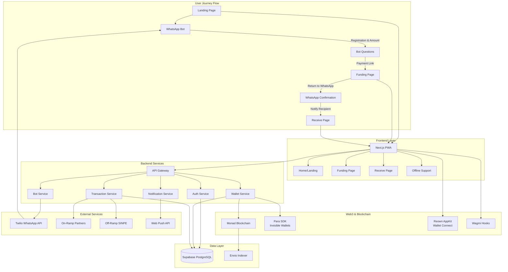

# Senu

A WhatsApp remittance application built with Next.js that enables international money transfers through WhatsApp messaging, focusing on the Costa Rica → Nicaragua corridor. The project combines Web3 technology with traditional fintech to create a seamless user experience.

## Architecture Overview

Senu is a comprehensive fintech solution that integrates WhatsApp Bot API, a Progressive Web App (PWA), blockchain technology, and traditional payment systems to enable seamless international remittances.

### System Architecture Diagram



### User Flow

#### For Senders (Origin Users)
1. **Landing Page**: Users start at the landing page
2. **WhatsApp Redirect**: Users are redirected to WhatsApp to interact with the bot
3. **Bot Registration**: Bot asks questions (name, country, amount to send)
4. **Funding Page**: Bot provides a link to the funding page in our PWA
5. **Payment Processing**: Users complete payment through various methods
6. **WhatsApp Return**: Users return to WhatsApp for confirmation and tracking

#### For Recipients (Destination Users)
1. **WhatsApp Notification**: Recipients receive a WhatsApp notification about incoming money
2. **Receive Page**: Clicking the notification opens our PWA's receive page
3. **Withdrawal Process**: Recipients can withdraw funds to their bank account or preferred method

## Technology Stack

### Frontend (Progressive Web App)
- **Framework**: Next.js 15.5.0 with TypeScript and App Router
- **Styling**: Tailwind CSS with shadcn/ui components
- **State Management**: TanStack Query for server state management
- **PWA Features**: Service Worker, push notifications, offline support
- **Mobile-First**: Responsive design optimized for mobile devices [[memory:6999967]]

### Backend & APIs
- **API Architecture**: Next.js API routes in `/app/api/`
- **Database**: Supabase (PostgreSQL) with Row Level Security
- **Authentication**: Custom JWT tokens with bcrypt hashing
- **Session Management**: In-memory conversation context with Redis fallback
- **Push Notifications**: Web Push API for real-time notifications

### Web3 & Blockchain Integration
- **Blockchain**: Monad network for fast, low-cost transactions
- **Wallet Management**: 
  - Para SDK for invisible custodial wallets
  - Reown AppKit for external wallet connections
- **Web3 Libraries**: 
  - wagmi v2 for React hooks
  - viem v2 for Ethereum interactions
  - ethers v6 for blockchain operations
- **Wallet Connection**: WalletConnect v2 protocol

### External Integrations
- **WhatsApp**: Twilio SDK for WhatsApp Business API
- **Payment Processing**: On-ramp and off-ramp partner integrations
- **Banking**: SINPE integration for Costa Rica/Nicaragua transfers
- **Indexing**: Envio for blockchain data indexing and analytics

## Quick Start

### Prerequisites
- Node.js 18+ and npm
- Twilio account with WhatsApp Business API access
- Supabase project for database

### Installation

1. **Clone and install dependencies**:
   ```bash
   git clone <repository-url>
   cd senu/web
   npm install
   ```

2. **Set up environment variables**:
   ```bash
   cp .env.example .env.local
   # Edit .env.local with your credentials
   ```

3. **Initialize database**:
   ```bash
   npx supabase db reset
   ```

4. **Start development server**:
   ```bash
   npm run dev
   ```

5. **For WhatsApp webhook testing**:
   ```bash
   # In another terminal
   npx ngrok http 3000
   # Use the ngrok URL in Twilio webhook settings
   ```

### Basic Commands

```bash
# Development
npm run dev              # Start development server
npm run build           # Build for production
npm run start           # Start production server

# Code Quality
npm run lint            # Run ESLint
npm run type-check      # TypeScript type checking

# Database
npx supabase db reset   # Reset database with migrations
npx supabase db push    # Push schema changes
```

## Key Features

- **WhatsApp Integration**: Conversational interface for money transfers
- **Progressive Web App**: Installable, offline-capable mobile experience
- **Blockchain Powered**: Monad network with invisible custodial wallets
- **Real-time Notifications**: Push notifications for transaction updates
- **Secure Authentication**: JWT-based auth with rate limiting
- **Mobile-First Design**: Optimized for Central American mobile users [[memory:6999967]]

## Documentation

For detailed documentation, see the [`/docs`](./docs/) directory:

- **[📖 Complete Documentation Index](./docs/README.md)** - Start here for all documentation
- **[🚀 Development Guide](./docs/development.md)** - Detailed setup and development workflow
- **[📱 Twilio Setup](./docs/twilio-setup.md)** - WhatsApp Business API configuration
- **[🔧 API Reference](./docs/api-reference.md)** - Complete API documentation
- **[🐛 Troubleshooting](./docs/troubleshooting.md)** - Common issues and solutions

## Project Structure

```
/
├── web/                          # Next.js PWA Application
│   ├── app/                      # App Router (Next.js 13+)
│   │   ├── api/                  # API Routes
│   │   ├── funding/              # Funding page for senders
│   │   ├── receive/              # Receive page for recipients
│   │   └── offline/              # PWA offline fallback
│   ├── components/               # React Components
│   ├── lib/                      # Services and utilities
│   └── public/                   # Static assets and PWA manifest
├── docs/                         # Documentation
├── project-specs/                # Technical specifications
└── postman/                      # API testing collection
```

## Contributing

1. Fork the repository
2. Create a feature branch: `git checkout -b feature/new-feature`
3. Make your changes following our coding standards
4. Write tests for new functionality
5. Submit a pull request [[memory:6999961]]

See the [Development Guide](./docs/development.md#contributing) for detailed contribution guidelines.

## Support

- **Documentation**: Check [`/docs`](./docs/) for comprehensive guides
- **Issues**: Report bugs and request features via GitHub Issues
- **API Testing**: Use the Postman collection in [`/postman`](./postman/)

## License

[License information to be added]