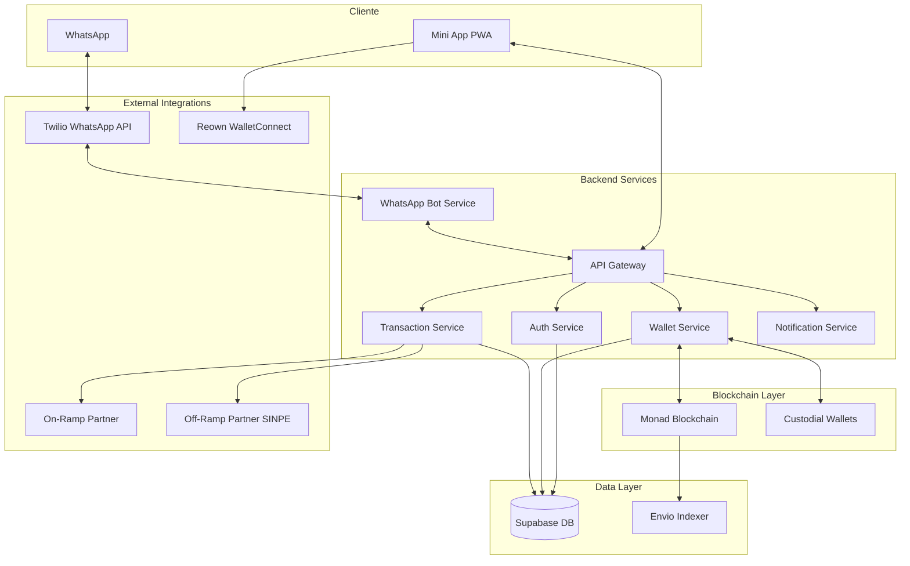
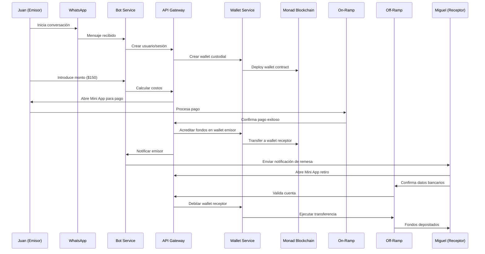

# Documento de Diseño

## Resumen General

El sistema de remesas por WhatsApp utiliza una arquitectura de microservicios con integración blockchain para gestionar transacciones entre Costa Rica y Nicaragua. La solución combina WhatsApp Bot API, una PWA con Mini App, wallets custodiales en Monad blockchain, y integraciones con socios de on-ramp/off-ramp para crear una experiencia fluida de "enviar dinero como un mensaje".

## Arquitectura

### Diagrama de Arquitectura del Sistema



### Flujo de Datos End-to-End



## Componentes e Interfaces

### WhatsApp Bot Service

**Responsabilidad:** Gestionar conversaciones, mantener contexto de sesión, enrutar comandos

**Interfaces:**
- `POST /webhook/whatsapp` - Recibe mensajes de Twilio
- `POST /send-message` - Envía mensajes via Twilio
- `GET /conversation/{phone}` - Obtiene estado de conversación

**Funcionalidades Clave:**
- Parser de intents (registro, envío, consulta)
- Gestión de estado conversacional
- Templates de mensajes pre-configurados
- Integración con Twilio WhatsApp Business API

### API Gateway

**Responsabilidad:** Punto de entrada unificado, autenticación, rate limiting

**Interfaces:**
- `POST /auth/register` - Registro de usuarios
- `POST /transactions/send` - Iniciar transacción
- `POST /transactions/withdraw` - Procesar retiro
- `GET /transactions/{id}` - Estado de transacción
- `GET /user/{phone}/wallet` - Info wallet usuario

**Middleware:**
- JWT Authentication
- Rate limiting por número telefónico
- Logging y métricas
- CORS para Mini App

### Wallet Service

**Responsabilidad:** Gestión de wallets custodiales, transacciones blockchain

**Interfaces:**
- `POST /wallets/create` - Crear wallet custodial
- `POST /wallets/transfer` - Transferir entre wallets
- `GET /wallets/{phone}/balance` - Consultar saldo
- `POST /wallets/withdraw` - Retirar a wallet externa

**Implementación:**
- Uso de Para Protocol para wallets invisibles al usuario
- Integración con Wagmi para interacciones Monad
- Gestión de claves privadas en HSM/KMS
- Gas management con 0x Protocol

### Transaction Service

**Responsabilidad:** Orquestación de transacciones, integraciones externas

**Interfaces:**
- `POST /onramp/process` - Procesar on-ramp
- `POST /offramp/process` - Procesar off-ramp
- `GET /transaction/{id}/status` - Estado de transacción
- `POST /transaction/{id}/retry` - Reintentar transacción fallida

**Estados de Transacción:**
```typescript
enum TransactionStatus {
  INITIATED = 'initiated',
  PAYMENT_PENDING = 'payment_pending', 
  PAYMENT_CONFIRMED = 'payment_confirmed',
  BLOCKCHAIN_PENDING = 'blockchain_pending',
  BLOCKCHAIN_CONFIRMED = 'blockchain_confirmed',
  WITHDRAWAL_PENDING = 'withdrawal_pending',
  COMPLETED = 'completed',
  FAILED = 'failed'
}
```

### Mini App PWA

**Responsabilidad:** Interfaz de usuario para pagos y retiros

**Componentes:**
- `PaymentFlow` - Procesamiento de pagos (Requisito 3)
- `WithdrawalFlow` - Proceso de retiro (Requisito 6)
- `WalletConnect` - Conexión wallets externas (fase prueba)
- `TransactionStatus` - Seguimiento de transacciones

**Tecnologías:**
- Next.js con SSR para performance
- Tailwind CSS + shadcn/ui para componentes
- Wagmi hooks para blockchain interactions
- Reown AppKit para wallet connections

## Modelos de Datos

### Usuario
```typescript
interface User {
  id: string;
  phone: string; // WhatsApp number
  name: string;
  country: 'CR' | 'NI';
  wallet_address: string;
  kyc_status: 'pending' | 'verified' | 'rejected';
  created_at: Date;
  updated_at: Date;
}
```

### Transacción
```typescript
interface Transaction {
  id: string;
  sender_phone: string;
  receiver_phone: string;
  amount_usd: number;
  amount_local: number; // CRC
  exchange_rate: number;
  fees: {
    platform_fee: number;
    onramp_fee: number;
    offramp_fee: number;
  };
  status: TransactionStatus;
  onramp_reference?: string;
  offramp_reference?: string;
  blockchain_tx_hash?: string;
  created_at: Date;
  completed_at?: Date;
  metadata: {
    onramp_provider: string;
    offramp_provider: string;
    user_agent?: string;
  };
}
```

### Wallet Custodial
```typescript
interface CustodialWallet {
  id: string;
  user_phone: string;
  blockchain_address: string;
  private_key_ref: string; // KMS reference
  balance_usd: number;
  nonce: number;
  created_at: Date;
}
```

### Esquema de Base de Datos
```sql
-- Usuarios
CREATE TABLE users (
  id UUID PRIMARY KEY DEFAULT gen_random_uuid(),
  phone VARCHAR(20) UNIQUE NOT NULL,
  name VARCHAR(100) NOT NULL,
  country VARCHAR(2) NOT NULL,
  wallet_address VARCHAR(42) NOT NULL,
  kyc_status VARCHAR(20) DEFAULT 'pending',
  created_at TIMESTAMP DEFAULT NOW(),
  updated_at TIMESTAMP DEFAULT NOW()
);

-- Transacciones
CREATE TABLE transactions (
  id UUID PRIMARY KEY DEFAULT gen_random_uuid(),
  sender_phone VARCHAR(20) REFERENCES users(phone),
  receiver_phone VARCHAR(20) NOT NULL,
  amount_usd DECIMAL(10,2) NOT NULL,
  amount_local DECIMAL(12,2) NOT NULL,
  exchange_rate DECIMAL(8,4) NOT NULL,
  fees JSONB NOT NULL,
  status VARCHAR(30) NOT NULL,
  onramp_reference VARCHAR(100),
  offramp_reference VARCHAR(100),
  blockchain_tx_hash VARCHAR(66),
  metadata JSONB DEFAULT '{}',
  created_at TIMESTAMP DEFAULT NOW(),
  completed_at TIMESTAMP
);

-- Wallets Custodiales
CREATE TABLE custodial_wallets (
  id UUID PRIMARY KEY DEFAULT gen_random_uuid(),
  user_phone VARCHAR(20) REFERENCES users(phone),
  blockchain_address VARCHAR(42) UNIQUE NOT NULL,
  private_key_ref VARCHAR(200) NOT NULL,
  balance_usd DECIMAL(12,6) DEFAULT 0,
  nonce INTEGER DEFAULT 0,
  created_at TIMESTAMP DEFAULT NOW()
);
```

## Manejo de Errores

### Estrategias por Componente

**WhatsApp Bot:**
- Timeout de conversación: 30 minutos de inactividad
- Mensajes no reconocidos: respuesta con opciones válidas
- Rate limiting: máximo 10 mensajes por minuto por usuario

**Transacciones:**
- On-ramp fallido: retry automático 3 veces, luego notificación manual
- Blockchain timeout: reintento con gas price incrementado
- Off-ramp fallido: mantener fondos en wallet, permitir retry

**Mini App:**
- Network errors: retry exponential backoff
- Wallet connection errors: fallback a opciones alternativas
- Payment failures: redirigir a método alternativo

### Códigos de Error Estándar
```typescript
enum ErrorCodes {
  // User errors (4xx)
  INVALID_PHONE = 'INVALID_PHONE',
  INSUFFICIENT_BALANCE = 'INSUFFICIENT_BALANCE',
  TRANSACTION_LIMIT_EXCEEDED = 'TRANSACTION_LIMIT_EXCEEDED',
  
  // System errors (5xx)
  ONRAMP_SERVICE_UNAVAILABLE = 'ONRAMP_SERVICE_UNAVAILABLE',
  BLOCKCHAIN_TIMEOUT = 'BLOCKCHAIN_TIMEOUT',
  WALLET_CREATION_FAILED = 'WALLET_CREATION_FAILED'
}
```

### Logging y Monitoreo
- Structured logging con contexto de transacción
- Métricas de latencia por endpoint
- Alertas automáticas para tasas de error > 5%
- Dashboard de estado del sistema en tiempo real

## Estrategia de Pruebas

### Pruebas Unitarias
- Cobertura mínima: 80% para servicios críticos
- Mocking de integraciones externas (Twilio, Monad, partners)
- Testing de lógica de negocio y validaciones

**Herramientas:**
- Jest para Node.js services
- React Testing Library para componentes PWA
- Supertest para testing de APIs

### Pruebas de Integración
- End-to-end flow testing con testnet Monad
- WhatsApp webhook simulation
- Sandboxes de partners (on-ramp/off-ramp)

**Escenarios Clave:**
- Flujo completo emisor → receptor exitoso
- Fallos de payment y recovery
- Timeout scenarios y reintentos
- Estados de wallet inconsistentes

### Pruebas de Performance
- Load testing: 100 transacciones concurrentes
- Tiempo de respuesta: < 5 minutos end-to-end (Requisito 9.4)
- Tasa de conversión: > 80% (Métricas PRD)

### Testing de Seguridad
- Penetration testing de APIs
- Audit de smart contracts custodiales
- Validación de manejo de claves privadas
- Testing de rate limiting y abuse prevention

### Entorno de Pruebas Técnicas (Pre-Socios)
**Configuración especial para demostración:**
- Mock on-ramp que simula pago exitoso
- Testnet Monad para transacciones reales
- WalletConnect integration en lugar de SINPE
- Métricas completas habilitadas para validación

**Requisitos de la Demo (Requisito 8):**
- 100 transacciones exitosas mínimo
- Métricas de conversión y tiempo registradas
- UI/UX identical a producción
- Capacidad de mostrar flow completo en tiempo real